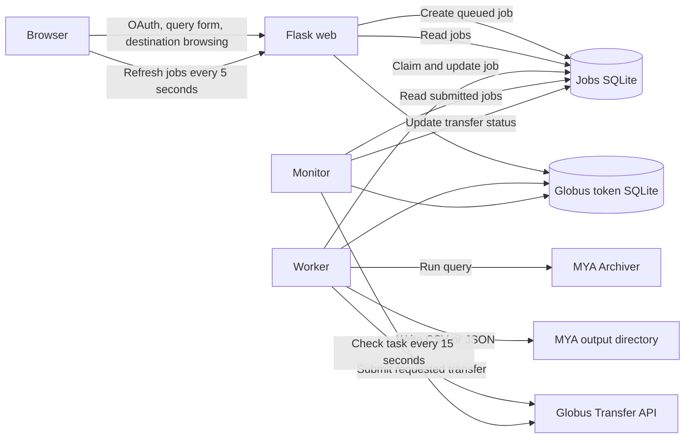

# Globus Web Prototype

Flask prototype for running MYA archive queries and optionally delivering the
generated files through Globus.

## Architecture

Docker Compose runs three persistent services:

- **web** handles Globus OAuth, destination collection browsing, query forms,
  job creation, and the Jobs dashboard. It queues work and returns immediately.
- **worker** atomically claims one queued job at a time, runs the requested MYA
  query, writes the export, and submits a Globus transfer when requested.
- **monitor** checks submitted Globus tasks and records their latest statuses.



The job database and Globus token database are separate:

- `instance/mya-transfer-jobs.sqlite3` stores durable job state.
- `instance/globus-tokens.sqlite3` is managed by the Globus SDK and stores the
  refresh-token authorization used by background services.

The project directory is mounted into every container, so the three services
see the same `instance/` databases. The worker and web service also share the
MYA export directory.

## Job Flow

Both query-only and query-and-transfer requests use the same job record. The
`transfer_requested` field determines whether processing stops after export or
continues into Globus submission.

1. Flask validates the selected query and creates a `queued` job.
2. The worker atomically claims it and changes the status to `query_running`.
3. The worker runs MYA and writes a uniquely named export under `/mya-output`.
4. A query-only job finishes as `query_complete`.
5. A transfer job advances through `transfer_submitting` and
   `transfer_submitted` after Globus accepts it.
6. The monitor records later Globus states such as `transfer_in_progress`,
   `transfer_succeeded`, or `transfer_failed`.

The browser reads the Jobs panel from SQLite every five seconds. This refresh
does not call MYA or Globus.

## Supported MYA Queries

The query form provides one tab for each supported query type:

- **MySampler**: start time, sample interval, sample count, and PV list
- **Interval**: begin/end times, one channel or a PV list, and optional prior point
- **MyStats**: start/end times, bin count, and PV list
- **Point**: channel and point-in-time lookup
- **Channel**: channel-name pattern search

MySampler, Interval, and MyStats results are exported as CSV. Point and Channel
results are exported as JSON. Every export receives a generated UUID filename
so concurrent and repeated jobs do not overwrite one another.

## Local Configuration

Create a local `.env` containing the required application and Globus values:

```text
FLASK_SECRET_KEY=<random-secret>
GLOBUS_CLIENT_ID=<confidential-client-id>
GLOBUS_CLIENT_SECRET=<confidential-client-secret>
GLOBUS_REDIRECT_URI=http://localhost:5000/callback

SOURCE_COLLECTION_ID=<source-collection-id>
SOURCE_DIRECTORY=/directory/as-seen-by-globus
MYA_EXPORT_HOST_DIR=/host/folder/exposed-by-globus
```

`MYA_EXPORT_HOST_DIR` is mounted at `/mya-output` in the web and worker
containers. If it is omitted, Compose uses `./mya-output`.

`SOURCE_DIRECTORY` is the same host folder as viewed from the configured source
Globus collection. It can differ from `MYA_EXPORT_HOST_DIR` because Docker and
Globus may see the shared directory through different paths.

Optional storage overrides include:

```text
JOBS_DB_PATH=/app/instance/mya-transfer-jobs.sqlite3
TOKEN_DB_PATH=/app/instance/globus-tokens.sqlite3
```

Optional worker safety limits include:

```text
WORKER_QUERY_TIMEOUT_SECONDS=3600
MAX_MYA_OUTPUT_BYTES=1073741824
```

The worker terminates MYA retrieval and local export creation that exceed these
limits. Export files are published only after a complete successful write.
The timeout does not apply to Globus data movement, which continues
asynchronously after transfer submission.

Optional queue admission limits include:

```text
MAX_PENDING_JOBS_PER_USER=10
MAX_PENDING_JOBS_GLOBAL=500
```

Only jobs in `queued` or `query_running` state count toward these limits.
Completed queries and Globus transfers do not consume queue capacity.

Compose currently sets the worker queue interval to two seconds and the Globus
monitor interval to fifteen seconds. `UID` and `GID` may also be set for the
container user when required by the host environment.

## Run With Docker

Build and start the web app, worker, and monitor:

```bash
docker compose up --build
```

For later runs when dependencies and the Dockerfile have not changed:

```bash
docker compose up
```

The web app is available at `http://localhost:5000`. Register this redirect URI
for the Globus confidential client:

```text
http://localhost:5000/callback
```

Stop the services with `Ctrl+C`, or run this from another terminal:

```bash
docker compose down
```

## Source Layout

- `app.py`: Flask routes, session handling, collection browsing, and presentation
- `config.py`: shared environment and storage paths
- `jobs.py`: job schema, CRUD, listing, and atomic queue claiming
- `mya_query.py`: MYA query implementations and dispatch
- `job_execution.py`: query export and optional transfer execution
- `globus_service.py`: reusable Globus authorization, URLs, statuses, and submission
- `worker.py`: queued-job processing loop
- `monitor.py`: submitted-transfer status loop
- `templates/`: query tabs, collection views, and Jobs dashboard

## Reference Prototype

`../globus_cli_demo/` remains reference code for verified Globus login,
collection consent, browsing, transfer submission, and task-status behavior.
